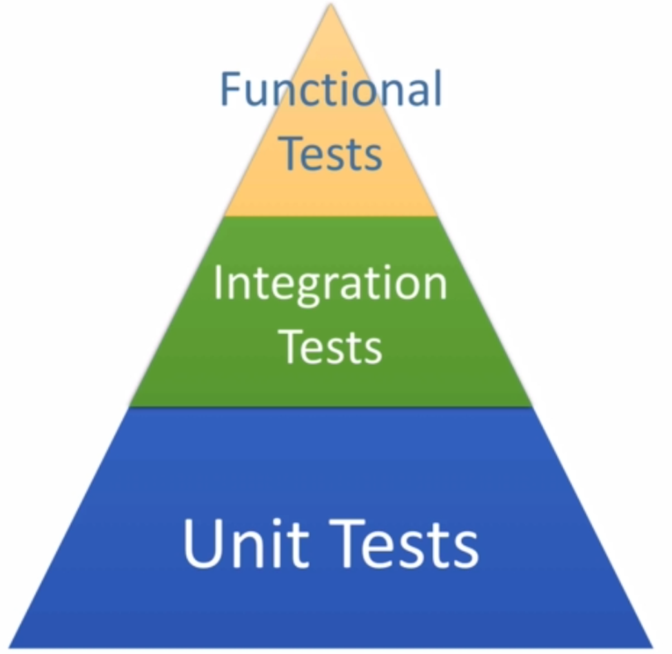

## Writing tests takes a lot of time. Why do it?
	Improves your software quality.
	Proves that your code is doing what you think it should be doing.
	And the fix one thing, break another !

## Testing Terminology
	Code Under Test - This is the code (or application) you are testing.
	Text Fixture: A test fixture is a fixed state of a set of objects used as a baseline for running tests.
	The purpose of a test fixture is to ensure that there is a well known and fixed environment in which tests are run so that results are repeatable.
		Includes: Input data, mock objects, loading database with known data, etc.

### Unit Tests/ Unit Testing
	Designed to test specific sections of code.
	Percentage of lines of code tested is code coverage.
	Ideal coverage is in the 70-80% range.
	Should be 'unity' and execute very fast.
	Should have no external dependencies.
	ie no database, no Spring context, etc.
	Unit test should be completely independent.

### Integration Tests - Designed to test behaviors between objects and parts of the overall system.
	Much larger scope.
	Can include the Spring Context, Database, and Message broker
	Will run much slower than unit tests.

###Functional Tests - Typically means you are testing the running application
Application is live, lively deployed in a known environment.
Functional touch points are tested (i.e. Using a web driver, calling web services, sending/receiving messsages, etc)

As far as speed, unit test is very fast, integration test not as fast depending on what you're doing and the slowest  tests are going to be your functional tests.

## Testing pyramid

The majority of your tests should be unit tests.
- Small, fast, light weight tests.
- Very detailed and specific

Integration Tests should be next largest category

Functional Tests are smallest and least detailed of the categories.

## Agile Testing Methods

TDD - Test Driven Development
Write tests firsts, code to 'fix' tests, refactor code to cleanup, improve etc.

BDD - Behavior Driven Development
Very similar to TDD
Describes the expected behavior of software.
Often expressed as: when/then; given/when/then

Use both!

## Testing Components

Mocks - A fake implementation of a class used for testing.
A test double for dependent objects - like a datasource.
Can provide expected responses.
Can verify expected interactions.

Spy - Like a mock - but real object is used
Mocks completelty replace expted object
Spys are wrappers, but with real object inside.

## Beyond Testing with CI and CD.
Continuous Integration (CI) is a development practice that requires developers to integrate code into a shared repository several times a day.
Each check-in in then verified by an automaated build, allowing teams to detect problems early.

Continuous Integration doesn't get rid of bugs, but it does make them dramatically easier to find and remove.

Continuous integration basically you're gonna set up a CI server. You're gonna check into source code, CI server is going to detect that.
It's gonna checked it out and build it in an independent system and if you break the build that's very bad.

## CI Practices
Maintain a single source repository
Automate build
Make Your Build slef-testing.
Every commiit should build on Integration Machine
Fix broken builds immediately
Keep the build fast.
Test in a clone of the Production Environment.
Make it easy for anyone to get the Latest Executable version.
Everyone can see what is happening.

## Common CI Build Servers
Self-Hosted: Jenkins, Bambo, TeamCity, Hudson.
Jenkins forked from Hubson in 2010 due to a legal conflict with Oracle.

Cloude Based: CircleCI, TravisCI...

## CD - Continous Development
Continous Deployment will automatically deploy build artifacts after all CI tests have run.
Should Happen with every Commit.
Completely Automated.
May Include a Staging Area from which Additional Automated Tests are run. You must have additional tests run after deployments.

## CD - Continuous Delivery
Proces to Automatically Deliver code changes directly to the Production Environment.
Involves a high degree of Automation in Tesing and Deployment

# Money Test

To do list

- $5 + 10 CHF = $10 (with rate of 2:1)
- $5 * 2 = $10
- Make “amount” private
- Dollar side effects?
- Money Rounding?
- equals()
- hashCode()
- equal null
- equal object
- dollar/france duplication
- common equals()
- common times()
- compare Francs with Dollars
- currency
- delete testMultiplicationFranc